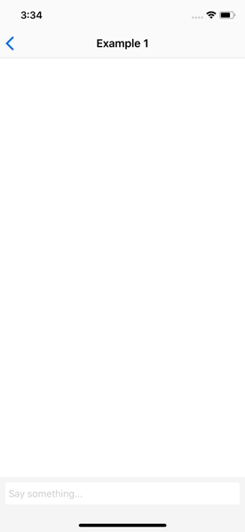

# GrowingTextView

[](http://cocoapods.org/pods/GrowingTextView)
[](http://cocoapods.org/pods/GrowingTextView)
[](http://cocoapods.org/pods/GrowingTextView)
[](http://cocoapods.org/pods/GrowingTextView)
[](http://cocoapods.org/pods/GrowingTextView)
[](http://cocoapods.org/pods/GrowingTextView)
[](http://cocoapods.org/pods/GrowingTextView)



## Requirements

iOS 8.0 or above

## Installation

#### CocoaPods

GrowingTextView is available through [CocoaPods](http://cocoapods.org). To install
it, simply add the following line to your Podfile:

Swift 5.0<br>

```ruby
pod 'GrowingTextView', '0.7.2'
```

Swift 4.2<br>

```ruby
pod 'GrowingTextView', '0.6.1'
```

Swift 4.1<br>

```ruby
pod 'GrowingTextView', '~> 0.5'
```

Swift 3<br>
```ruby
pod 'GrowingTextView', '~> 0.4'
```

Swift 2.3 (Stopped update since Sep 2016)<br>
```ruby
pod 'GrowingTextView', :git => 'https://github.com/KennethTsang/GrowingTextView.git', :branch => 'swift2'
```

#### Carthage

GrowingTextView is also available through
[Carthage](https://github.com/Carthage/Carthage). To install it, add the following
line to your Cartfile:

Swift 5.0<br>

```ruby
github "KennethTsang/GrowingTextView" ~> 0.7
```

Swift 4.2<br>

```ruby
github "KennethTsang/GrowingTextView" ~> 0.6
```

Swift 4.1<br>

```ruby
github "KennethTsang/GrowingTextView" ~> 0.5
```

Swift 3<br>
```ruby
github "KennethTsang/GrowingTextView" ~> 0.4
```

Swift 2.3 (Stopped update since Sep 2016)<br>
```ruby
github "KennethTsang/GrowingTextView" "swift2"
```

#### Manually

Copy `GrowingTextView.swift` into your project.

## Usage

**Example**<br>

GrowingTextview is just a textview, download the example to see how to use it as a input toolbar like other instant messaging apps.

**Using GrowingTextview programmatically**<br>

```swift
let textView = GrowingTextView()
textView.delegate = self
addSubview(textView)
```

**Using GrowingTextview in Storyboard**<br>

1. Drag a TextView into Storyboard.
2. Set class to "GrowingTextView".
3. Set delegate to it's view controller.


##### automaticallyAdjustsScrollViewInsets<br>

Sometime the view controller may incorrectly adjust the inset of textview automatically. To avoid this, set `automaticallyAdjustsScrollViewInsets` to `false`

```swift
override func viewDidLoad() {
	super.viewDidLoad()
	automaticallyAdjustsScrollViewInsets = false
}
```

## Customization

| Parameter                      | Type                | Description                              | Default                         |
| ------------------------------ | ------------------- | ---------------------------------------- | ------------------------------- |
| *maxLength*                    | Int                 | Maximum text length. Exceeded text will be trimmed. 0 means no limit. | *0*                             |
| *trimWhiteSpaceWhenEndEditing* | Bool                | Trim white space and new line characters when textview did end editing. | *true*                          |
| *placeholder*                  | String?             | Placeholder text.                        | *nil*                           |
| *placeholderColor*             | UIColor             | Placeholder text color.                  | UIColor(white: 0.8, alpha: 1.0) |
| *attributedPlaceholder*        | NSAttributedString? | Attributed Placeholder text.             | *nil*                           |
| *minHeight*                    | CGFloat             | Minimum height of textview.              | *0.0*                           |
| *maxHeight*                    | CGFloat             | Maximum height of textview.              | *0.0*                           |

#### Examples

```swift
textView.maxLength = 140
textView.trimWhiteSpaceWhenEndEditing = false
textView.placeholder = "Say something..."
textView.placeholderColor = UIColor(white: 0.8, alpha: 1.0)
textView.minHeight = 25.0
textView.maxHeight = 70.0
textView.backgroundColor = UIColor.whiteColor()
textView.layer.cornerRadius = 4.0
```

## Animation

1. Adopt `GrowingTextViewDelegate` instead of UITextViewDelegate.
2. Implement textViewDidChangeHeight.
3. Call layoutIfNeeded() on superview inside the animation.

```swift
class ViewController: UIViewController, GrowingTextViewDelegate {
	func textViewDidChangeHeight(_ textView: GrowingTextView, height: CGFloat) {
	   UIView.animate(withDuration: 0.2) {
	       self.view.layoutIfNeeded()
	   }
	}
}
```


## Delegate

`GrowingTextViewDelegate` is inherited from UITextViewDelegate. You may use it's delegate function as a normal UITextView.

```swift
class ViewController: UIViewController, GrowingTextViewDelegate {
    func textViewDidChange(_ textView: UITextView) {
    	...
    }
    func textViewDidEndEditing(_ textView: UITextView) {
    	...
    }
}
```

Check out UITextViewDelegate here: [https://developer.apple.com/reference/uikit/uitextviewdelegate](https://developer.apple.com/reference/uikit/uitextviewdelegate)

## Author

Kenneth Tsang, kenneth.tsang@me.com

## License

GrowingTextView is available under the MIT license. See the LICENSE file for more info.
